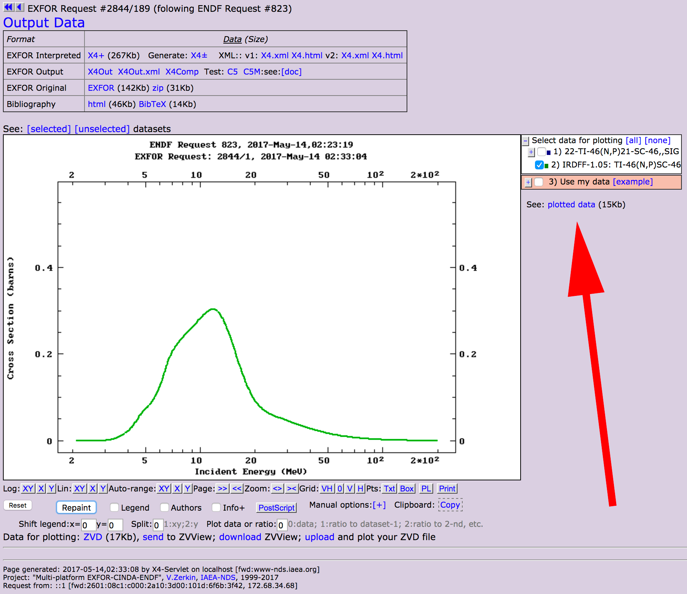

# LSL Plotter

The LSL plotter (`plot_lsl.py`) can be used to plot the correlation coefficient matrix, the cross section, the cross section uncertainty (as percentages) and the cross section $\pm$ 1$\sigma$ uncertainties.  The file takes in `...lsl` files as an input.

More information is available with `python plot_lsl.py --help`.

# ZVD Plotter

The ZVD plotter (`plot_zvd.py`) can read either or both evaluated (two-column) or experimental (four-column) datafiles from the EXFOR database plotting utility.  The screenshot below shows how the data files can be obtained.

More information is available with `python plot_zvd.py --help`.